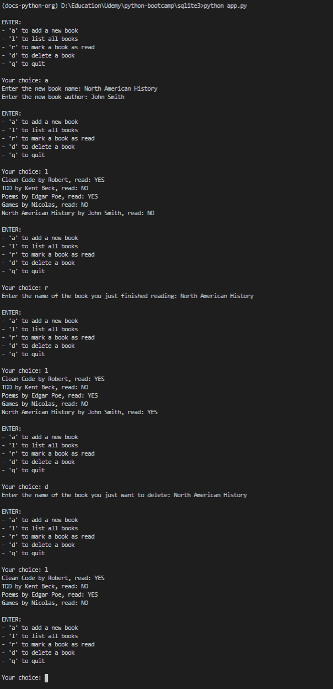

# SQLite Library

## Table of Contents
- [Introduction](#introduction)
- [Features](#features)
- [Screenshots](#screenshots)
- [Setup](#setup)
- [Technologies](#technologies)

## Introduction
SQLite-library is a console based application that uses console prompts to allow a user to interact with a digital library. The application uses an SQLite database to store the data.

The purpose of this project was to become more familiar with SQLite.

## Features
- Add book
- List books
- Read book (mark as read)
- Delete book

## Screenshots


## Setup
To run, in the console enter:
```
python app.py
```

## Technologies
- [Python 3.8.3](https://www.python.org/downloads/release/python-383/)
- [SQLite](https://sqlite.org/index.html)
- [sqlite3 2.6.0](https://docs.python.org/3/library/sqlite3.html)
